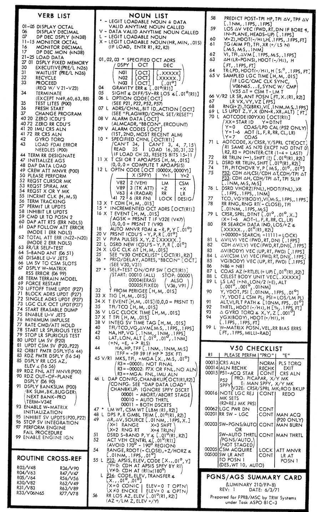

# Space and Things: 1201 Alarm
## Description
The premise of this challenge is straightforward. We have to connect a DSKY to the AGC Commanche055 instance that is given in the netcat. Then, figure out the value of PI on the machine.

## Connecting to the Server
Compiling the virtualagc from source turned out to be a challenge for us, on both Macbooks and Windows 10 machines. Luckily, we found a VirtualBox VM with AGC preinstalled, see [sources](#resources).

Power on the VM, and the yaDSKY executable is located at /home/virtualagc/VirtualAGC/bin

Use this to connect to the server: `./yaDSKY2 --ip=3.22.223.17 --port=6942`

If you get an error message like “Can’t load image…”, just copy the images from https://github.com/virtualagc/virtualagc/tree/master/yaDSKY2 to /home/virtualagc/VirtualAGC/bin.

## Getting PI
Initially, we found some documentation stating that the instruction “Verb 27, Noun 01” would display fixed memory on the system. 

<a href="https://www.ibiblio.org/apollo/A17_VN_Checklist.png"></a>

We also found in the source code for Comanche055, the constant PI/16 appeared in the file TIME_OF_FREE_FALL.agc. Now the challenge was to find the address corresponding to this entry in the code.

The next important discovery was that listing files for the Comanche055 source were available in addition to the raw assembly, the relevant file accessible here: http://www.ibiblio.org/apollo/listings/Comanche055/TIME_OF_FREE_FALL.agc.html. The format of the listing file is not documented. The first entry on each line was listed for lines with only comments or nothing at all, so that was most likely just a line number. Out of the remaining values, one which took the form xx,yyyy incremented on each line of code, while the other was simply a single value which varied. This led us to believe the first was the memory address of each line of code, supported by the fact that Apollo memory was organized into one-kiloword banks. Documentation found later revealed that xx,yyyy is a format for relative addresses referring to the memory at address yyyy in bank xx. This got us nearly there, but verb 27 only accepts fixed addresses, not a bank plus relative offset.

Next, we found some documentation stating 
```
The addresses will be 00000-01777 for memory bank 00, 02000-03777 for memory bank 01, and so forth, up to 76000-77777 for memory bank 37.” 
(https://virtualagc.github.io/virtualagc/index.html)
```
This documentation revealed the conversion from relative “bank,address” notation to absolute address. The absolute address is (bank number - 1)*2000 + (relative address) in octal. 

With this information, we input the fixed address (27-1)*2000+3355 = 57355, which corresponds to 27,3355, the location of PI/16, into our own AGC running Comanche055 and got the correct value. (or, the first word of the correct value; the second was simply obtained by incrementing the address by 1) 

However, connecting to the AGC on the server, we did not obtain a value anywhere close to pi at this address. The problem stated that there was a “tangle” and the number of constants in that memory region had changed over time, so we decided to investigate close by memory addresses. Decrementing the address to 27,3353 gave the value 24775 30424, which matches the assembly listing, so we instead tried incrementing the address. The next few values did not match the assembly listing, and we found that the value stored at 27,3361 was close to PI/16 and also had a different value for team members connected to different instances of the challenge, a strong indication that we had the right address.

With this, we were able to figure out the exact AGC command: 
* 27 01 57361 - To get the high bits 
* 27 01 57362 - To get the lower bits

## Resources
* Compiling VirtualAGC from source: https://github.com/virtualagc/virtualagc
* VirtualBox VAGC Image: https://www.ibiblio.org/apollo/download.html
* AGC Guidebook: https://www.ibiblio.org/apollo/hrst/archive/1706.pdf