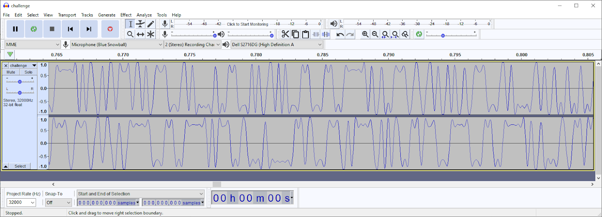
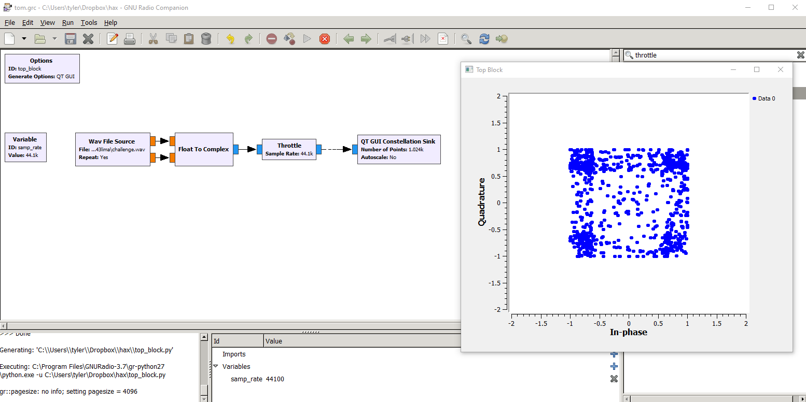
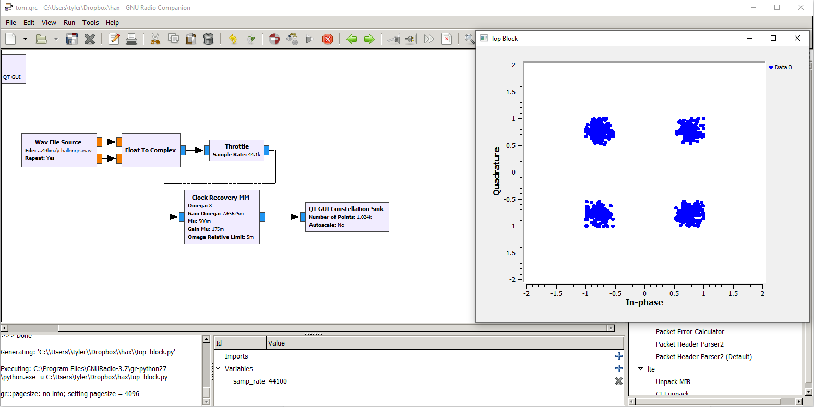
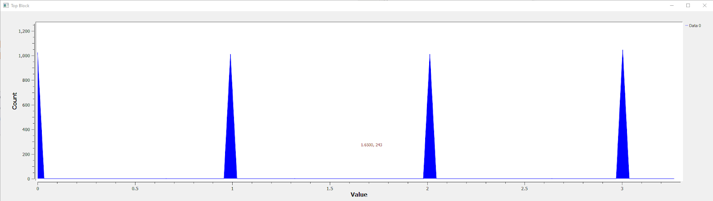
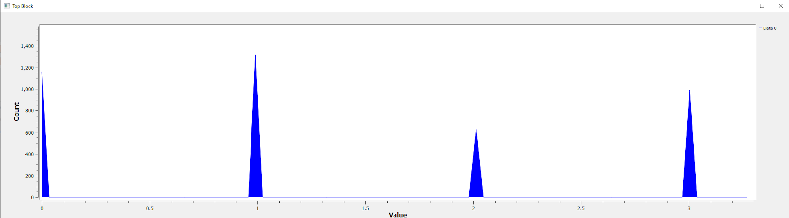
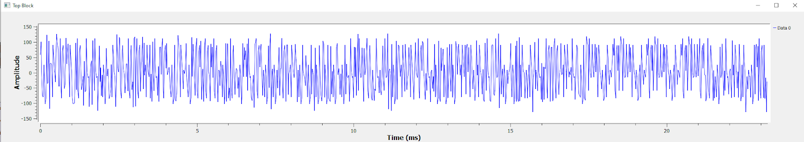
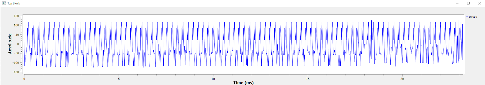
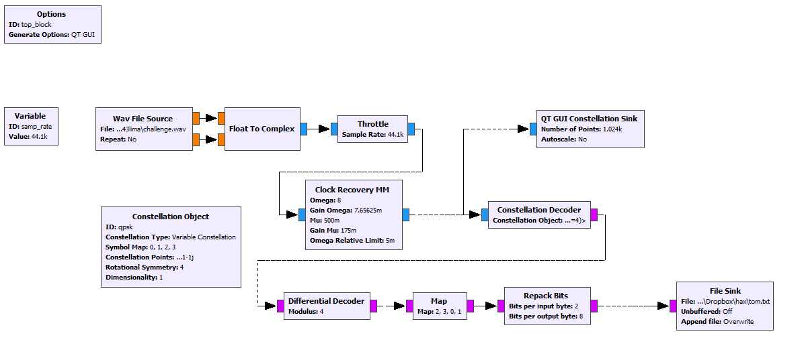

# Ground Control to Major Tom
## Problem Statement
You killed that last one. Ready to take it to the next level?

We’re given a wav file and nothing else to go on

## Approach
The first thing we want to do is try to get an idea for how the data in the wav file is modulated. We opened the wav file in audacity to get an initial idea

Zooming in, we get a lot of useful information:


A few notes about the signal to get started: There is significant low-frequency content (sustained 1’s and 0’s) which suggests that the signal is already at baseband There are two channels. These could be two different data streams but more likely it’s the I and Q phases of the baseband signal The amplitude looks to be constant, suggesting this is likely Phase-shift Keying (PSK) rather than something involving amplitude (like QAM) There seem to be about 8 samples per symbol

We used GNURadio to demodulate the signal

With an extremely simple flowgraph, we can see a rough constellation of the data. There are four hotspots so this is QPSK modulation.



We can recover the timing with just one more simple block:



Now we have the data separated into two-bit symbols, but a few issues remain We don’t know if this is absolute or differential QPSK We don’t know which symbols are the most/least significant parts of the byte We don’t know which symbol maps to which two-bit sequence We can determine if it’s absolute or differential QPSK by looking for I like to take a histogram of the data - ordered data such as sync words or ASCII text would show up in a histogram because they would cause some symbols to show up much more often (All ASCII letters start with ‘01’, for instance)

Histogram of raw symbols:


Histogram of differentially decoded symbols:


We can see a drastic difference in these histograms - it’s clear the data is differential

The difference is also clear in time domain, where some sync pattern is clearly visible Raw symbols:


Differentially decoded:


Now we just need to determine symbol mappings. For us, this was a matter of guess-and-check. We eventually found a symbol mapping that produced text. Here is the complete flowchart which produces an output file:


The text file contains data which looks like this in ascii

An????d I'm f????loating???? in a m????ost pec????uliar w????ay And ????the sta????rUUUUUU????0P?v?????9?

It’s clear we still need to remove sync words. This could be done in gnuradio with some effort, but it’d be easier to do it with a script (or in our case, with a text editor search/replace)

We get our final result containing the flag:
```
Ground Control to Major Tom
Ground Control to Major Tom
Take your protein pills and put your helmet on
Ground Control to Major Tom (ten, nine, eight, seven, six)
Commencing countdown, engines on (five, four, three)
Check ignition and may God's love be with you (two, one, liftoff)
This is Ground Control to Major Tom
You've really made the grade
And the papers want to know whose shirts you wear
Now it's time to leave the capsule if you dare
"This is Major Tom to Ground Control
I'm stepping through the door
And I'm floating in a most peculiar way
And the starUUUUUU0P?v??9???jflag{lima20243lima:GEeqt-XXinABXCW6m2KCB4B12SJIaWIIn7NOpSb0__P630F0M-ZF8VopDX9bMWlP61efbggkqEmVlHwhAgk850s}0P?>??9???2s look very different today
For here
Am I sitting in a tin can
Far above the world
Planet Earth is blue
And there's nothing I can do
Though I'm past one hundred thousand miles
I'm feeling very still
And I think my spaceship knows which way to go
Tell my wife I love her very much she knows
Ground Control to Major Tom
Your circuit's dead, there's something wrong
Can you hear me, Major Tom?
Can you hear me, Major Tom?
Can you hear me, Major Tom?
Can you "Here am I floating 'round my tin can
Far above the moon
Planet Earth is blue
And there's nothing I can do"
```

