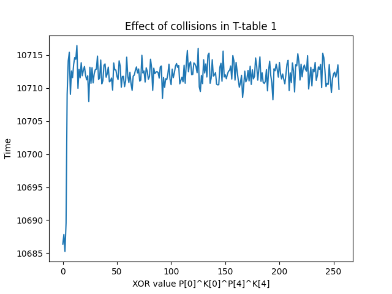
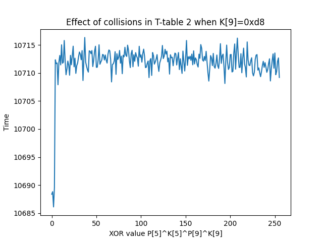

# Leaky Crypto
## Challenge
In this challenge, we are given data encrypted with an unknown AES key, and our task is to recover the decrypted payload. We are provided with 100000 timing measurements for various AES plaintexts, and it is implied that a side-channel attack can be used to recover the key. In addition, we are given the first 6 bytes of the key.

## Approach
Since we lack the AES implementation and details of the hardware, we use trial-and-error to guess at the side-channel leakage model and use statistical tests on the encryption data to see if we are correct. We first attempt the timing attack[^1] of Bernstein, but we do not find statistical significance.

We next attempt the one-round attack[^2] of Tromer et al. We assume the AES implementation uses four T-tables, and cache hits in these tables cause a timing difference. A cache hit in the first T-table should occur when the exclusive-or of the first plaintext byte, first key byte, fourth plaintext byte, and fourth key byte is zero. We compute this exclusive-or for each data sample and find a statistically significant timing difference, confirming our assumption. In fact, we find that the difference is significant when the exclusive-or has a value of 0, 1, 2, or 3.



We perform the same test on the second T-table. We expect the same statistical difference to occur when the exclusive-or of the fifth plaintext byte, fifth key byte, ninth plaintext byte, and ninth key byte is 0, 1, 2, or 3. The first three bytes are known for each data sample, so we determine which values of the ninth key byte produce the expected distribution. Only four of 256 values produce this distribution (those whose 6 upper bits match 0xd8), so we have successfully recovered six more bits of the key.



We repeat this process for the first 12 T-table lookups and learn a total of 90 bits of the key. However, we find no more statistically significant difference for the 13th lookup and onward. To recover the remaining 38 key bits, we use a brute-force attack.

To perform the brute force attack, we take the first 16 bytes of encrypted data from the challenge and attempt to decrypt it with each of the 2^38 candidate keys. If the candidate decryption has no byte values above 127, it may be ASCII text, so we log the potential key and decryption to a file. Using the AES-NI instructions for fast decryptions, our implementation tests 80 million keys/second, and we search the full keyspace in approximately one hour.

Our test for a potentially valid ASCII plaintext creates about 2^22 false positives. To eliminate the false positives, we take each of the remaining candidate keys and decrypt all blocks of the encrypted data. Only one candidate key yields ASCII text in every plaintext block, and so this is the correct AES key. The flag is the decrypted payload.

```
flag{mike71770yankee:GFq_-XcL38zDoEgx53b7of68UeGMqTc5NlCnFLqsz1HXn_-KSWpwhapO1EZeUaw1EWfpOP3ZM5IvSpDh1TGg8XQ}
```

[^1]: Bernstein, Daniel J. "Cache-timing attacks on AES." (2005) 

[^2]: Tromer, Eran, Dag Arne Osvik, and Adi Shamir. "Efficient cache attacks on AES, and countermeasures." Journal of Cryptology 23, no. 1 (2010): 37-71.