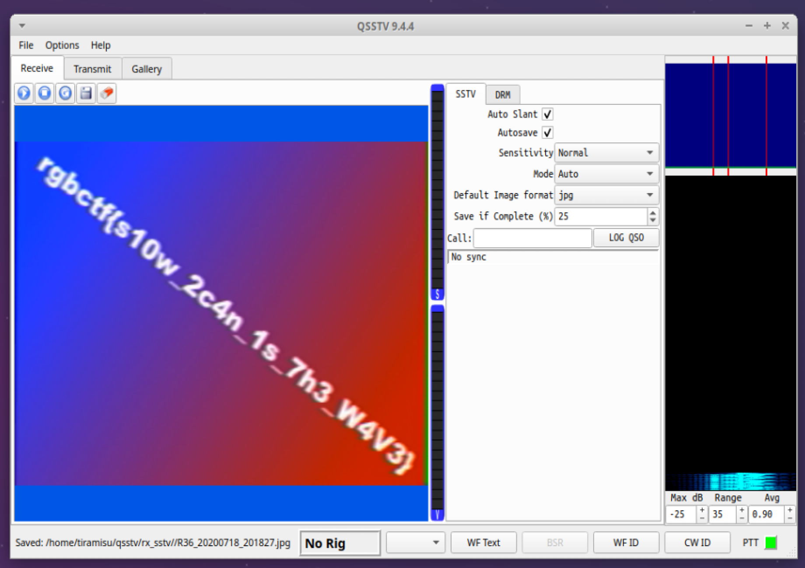

# Alien Transmission 1
## Challenge Description
I was listening to my radio the other day and received this strange message... I think it came from an alien?

File: squeakymusic.wav

## Solution
The audio sounds like an [SSTV](https://en.wikipedia.org/wiki/Slow-scan_television) transmission. SSTV is a protocol to convert images into audio. I used a program called `qsstv` to convert the audio transmission into an image.

Here's install instructions:
> sudo apt-get install pavucontrol
> sudo apt-get install g++ libfftw3-dev qt5-default libpulse-dev
> sudo apt-get install hamlib-dev libasound2-dev  libv4l-dev
> sudo apt-get install libopenjp2-7 libopenjp2-7-dev
> sudo apt-get install qsstv

1. Pipe the audio output to a virtual cable. 
> pactl load-module module-null-sink sink_name=virtual-cable
> pavucontrol
Confirm in the `Output Devices` tab, `Null Output` exists.
2. Open the qsstv program. 
> qsstv
Confirm in `Options -> Configuration -> Sound` it's using PulseAudio. 
3. Play the wave file.
> paplay -d virtual-cable squeakymusic.wav

The flag is rgbCTF{s10w_2c4n_1s_7h3_W4V3}

### Author
[tiraaamisu](https://github.com/Lindzy)