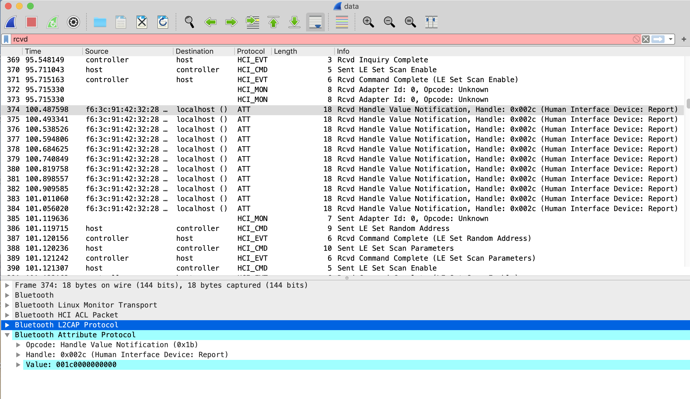

# PI1: Magic In The Air
## Challenge Description
We are investigating an individual we believe is connected to a group smuggling drugs into the country and selling them on social media. You have been posted on a stake out in the apartment above theirs and with the help of space-age eavesdropping technology have managed to extract some data from their computer. What is the phone number of the suspect's criminal contact?

flag format includes country code so it should be in the format: rgbCTF{+00000000000}

File: magic_in_the_air.7z

## Solution
Inside the 7z, there's a 'data' file with no file extensions. Opening the file in a hex editor, I see it has a btsnoop file header so I open it in Wireshark.

After poking around in Wireshark, I determined this was a keystroke log for a bluetooth keyboard. 

I followed the Rcvd Handle Value Notifications and used [this](https://gist.github.com/MightyPork/6da26e382a7ad91b5496ee55fdc73db2) to map the keystrokes.

For example, in this screenshot, the value is 001c0000000000, which maps to keypress 'y'


The user typed:
```
yoo man
sorry for the delay lol
trying to get this keyboard working
yeah its new wireless man
been moving product 
speaking of you needed to contact my boy right
ye
should be fine just say Johnny H sent you
Alright lemme get you the number 
hold up I'm looking for it
its his burner, got it written down somewhere  
yeah got it
0736727859
mind it is a swedish number he got it on holiday there few months back
yeah you can buy burners super easily there
alright g
yeah its donny l
remember to tell him i sent you
peace
```

The flag is rgbCTF{+46736727859}

### Author
[tiraaamisu](https://github.com/Lindzy)