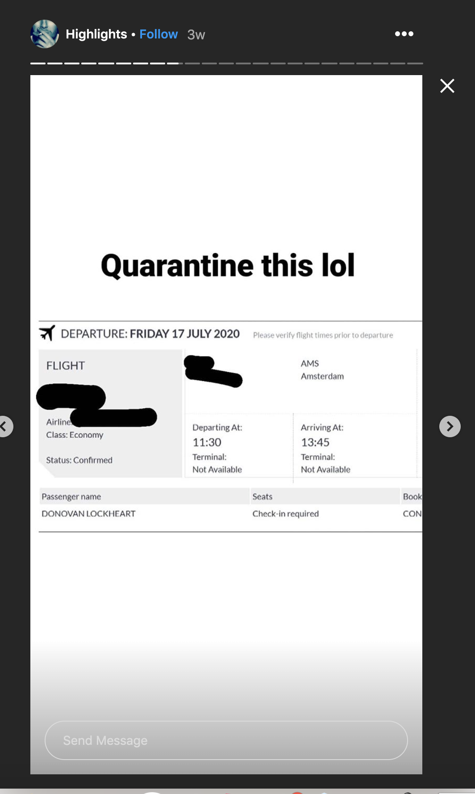

# PI2: A Series of Tubes
## Challenge Description
Use the personal information uncovered from PI 1 to find out where our suspect's contact lives, his full name and the next flight he is taking.

The flag for this challenge is in the following format: rgbCTF{firstnamelastname:homecity:countrycode:flightnumber} where countrycode is the ISO 3166-1 Alpha 2 code

## Solution
We have this phone number from PI1: 46736727859. First, we found a WhatsApp account associated with the phone number. The account didn't have much information aside from "hit me up on sc" in the profile. We looked up the Snapchat account and there was a story with a screenshot of their instagram.

The instagram account was: https://www.instagram.com/donnylockheart9/ and we found:

Selly Oak is a neighborhood in Birmingham.

You can easily find the flight number: KL1630, based on the length of the flight, and the time and destination.

The flag is rgbCTF{donovanlockheart:birmingham:gb:kl1630}

### Author
[tiraaamisu](https://github.com/Lindzy)