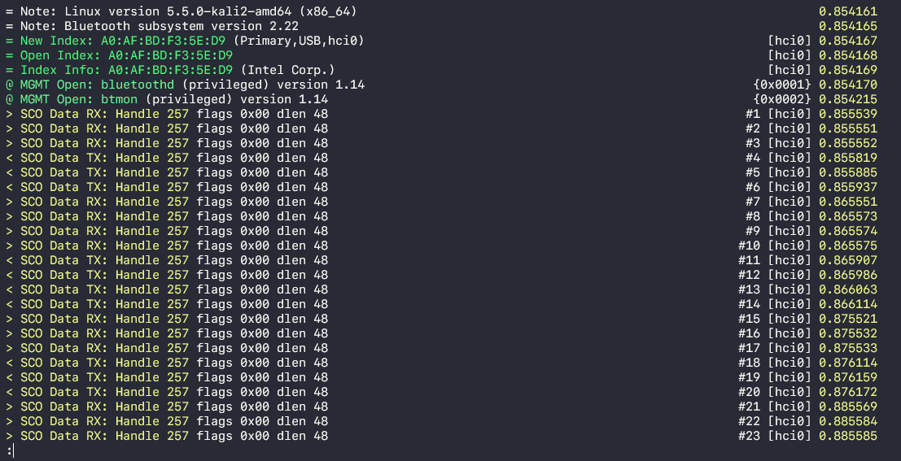
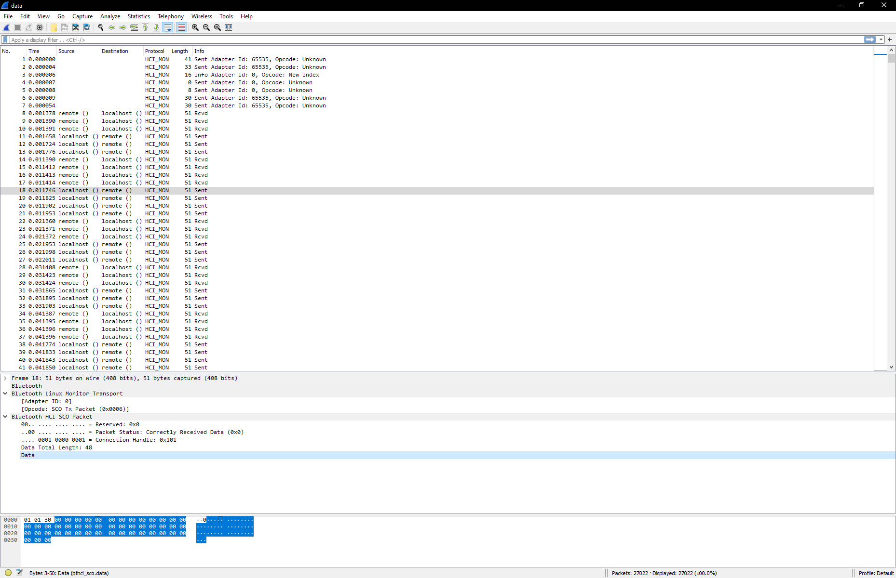

# PI 3: This isn't a secure line
## Challenge Description
Our suspect is getting noided. We've managed to retrieve this from his computer. What can you find?

The flag format is the MD5 hash of what you will find. rgbCTF{hash}

File: [data.7z](data) 

## Solution

First extract the .7z to obtain a `data` file. Running the `file` command on this reveals:
```bash
➜  pi3 file data
data: BTSnoop version 1,
```

So we can use `btmon -r data` to read the data, revealing that the protocol is [SCO](https://en.wikipedia.org/wiki/List_of_Bluetooth_protocols#Synchronous_Connection-Oriented_(SCO)_link):



At this point we know we need to extract audio from the data. Opening the btsnoop data in Wireshark allows us to inspect the individual SCO packets:


Aside from the configuration packets at the start, the data packets all have a length of 51. There are also two streams, which we can observe from the two types of packets, `Sent` and `Rcvd`. We can also see that all Bluetooth HCI SCO packets have a 3 byte header of `01 01 30`.

We can filter for sent data packets by opcode, since they have a Bluetooth Linux Monitor Transport opcode of `0x0006`:

```
(frame.len == 51) && (hci_mon.opcode == 0x0006)
```

Similarly, received packets have an opcode of `0x0007`:
```
(frame.len == 51) && (hci_mon.opcode == 0x0007)
```

Save the filtered packets as new .pcap files ([sent.pcap](sent.pcap) and [recv.pcap](recv.pcap) respectively).

I wrote a quick python script ([make_raw.py](make_raw.py)) in order to strip the 3 byte header from all of the packets, so we are left with the raw data bytestream:

```python
# make_raw.py

f_pcap = open("./recv.pcap", "rb")
f_raw = open("./recv.raw", "wb")

data = f_pcap.read()
pos = 0

while pos != -1:
    pos = data.find("\x01\x01\x30")
    data = data[pos+3:]
    f_raw.write(data[:0x30])

f_pcap.close()
f_raw.close()
```

Finally use [sox](http://sox.sourceforge.net/) to convert the .raw files into .wav:

```bash
➜  sox -t raw -r 8100 -e signed-integer -b 16 -L -c 1 recv.raw recv.wav
```

giving [sent.wav](sent.wav) and [recv.wav](recv.wav).

Playing back sent.wav we can hear the suspect mention that their new password is "applepie"; just MD5 this and wrap it in flag format:

```bash
➜  pi3 echo -n applepie | md5sum
6cc7c5a5a21978e5587a59186cadb5e3  -
```

## Flag
```rgbCTF{6cc7c5a5a21978e5587a59186cadb5e3}```

### Author
[onionymous](https://github.com/onionymous)