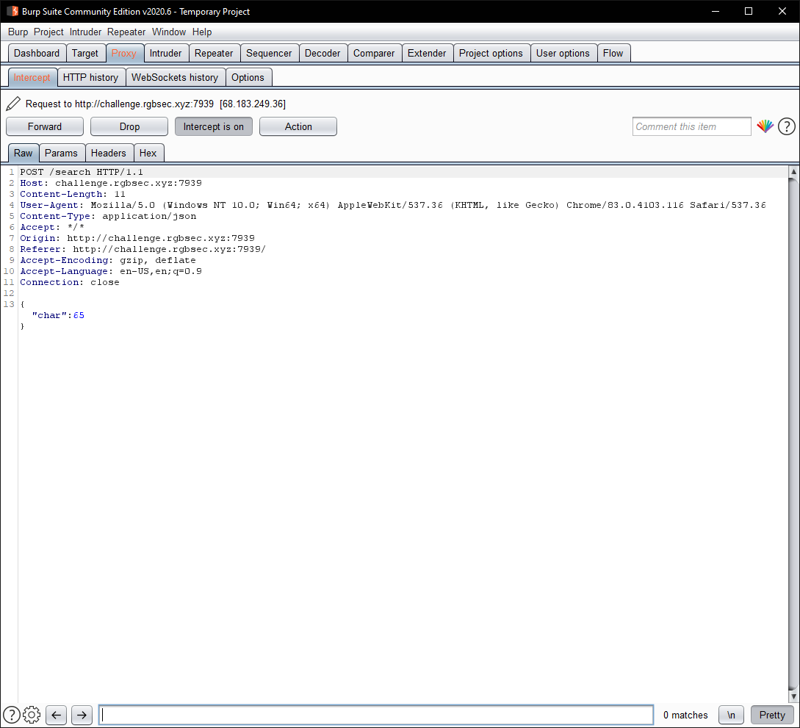
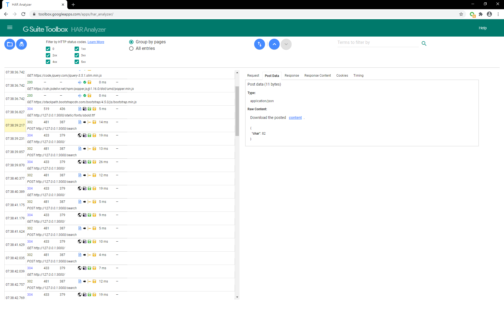

# Imitation Crab
## Challenge Description
Flag should be modified to fit the rgbCTF format (rgbCTF{flag}, underscores between words)

[http://challenge.rgbsec.xyz:7939/](http://challenge.rgbsec.xyz:7939/)

## Solution

We see a website with an onscreen keyboard. Pressing any key sends a POST request to the `/search` endpoint with the ASCII character code of the key being pressed:



Checking `/robots.txt`, we are pointed to
```
/static/export.har
```
We can download this file ([export.har](export.har)), it is in [HTTP archive format](https://en.wikipedia.org/wiki/HAR_(file_format)).

Using something like Google's [HAR Analyzer](https://toolbox.googleapps.com/apps/har_analyzer/) we can examine the HTTP requests (should have probably written a script to automate this though); in particular the ones to `/search`:



Converting the char codes to text, we get:

```
RGBCTF H4R F1L3S 4R3 2UP3R US3FU1
```

Modifying it to fit the flag format:

## Flag
```
rgbCTF{h4r_f1l3s_4r3_2up3r_us3fu1}
```

### Author
[onionymous](https://github.com/onionymous)