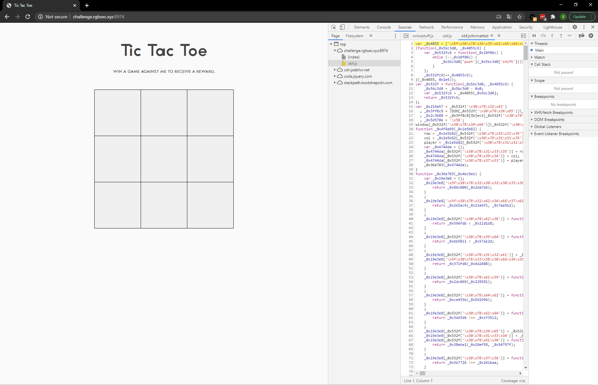

# Tic Tac Toe
## Challenge Description
Hello there, I invite you to one of the largest online global events in history ... the Tic Tac Toe World Championships!

 [http://challenge.rgbsec.xyz:8974/](http://challenge.rgbsec.xyz:8974/)

## Solution

_Note: this is a non-standard/unintended solution. Judging from the flag I guess the correct wave to solve this is with events. something something security through obscurity :x_

Visiting the site we see a tic-tac-toe game; in the sources there is an JavaScript file named `obf.js`.



Using [jsnice.org](jsnice.org) we can partially deobfuscate the code; revealing an interesting base64-encoded string in the source:

```
...
"cmdiQ1RGe2g0aDRfajR2NDJjcjFwN19ldjNuNzJfQVIzX2MwMEx9",
...
```

Base64 decoding this string gives us the flag:

## Flag
```rgbCTF{h4h4_j4v42cr1p7_ev3n72_AR3_c00L}```

### Author
[onionymous](https://github.com/onionymous)