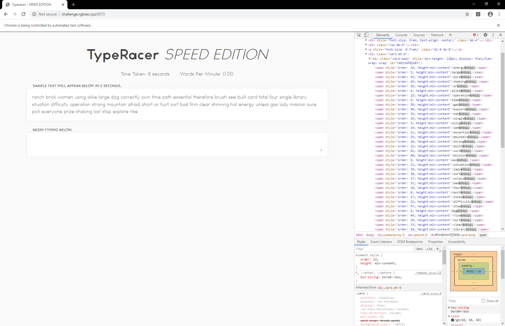
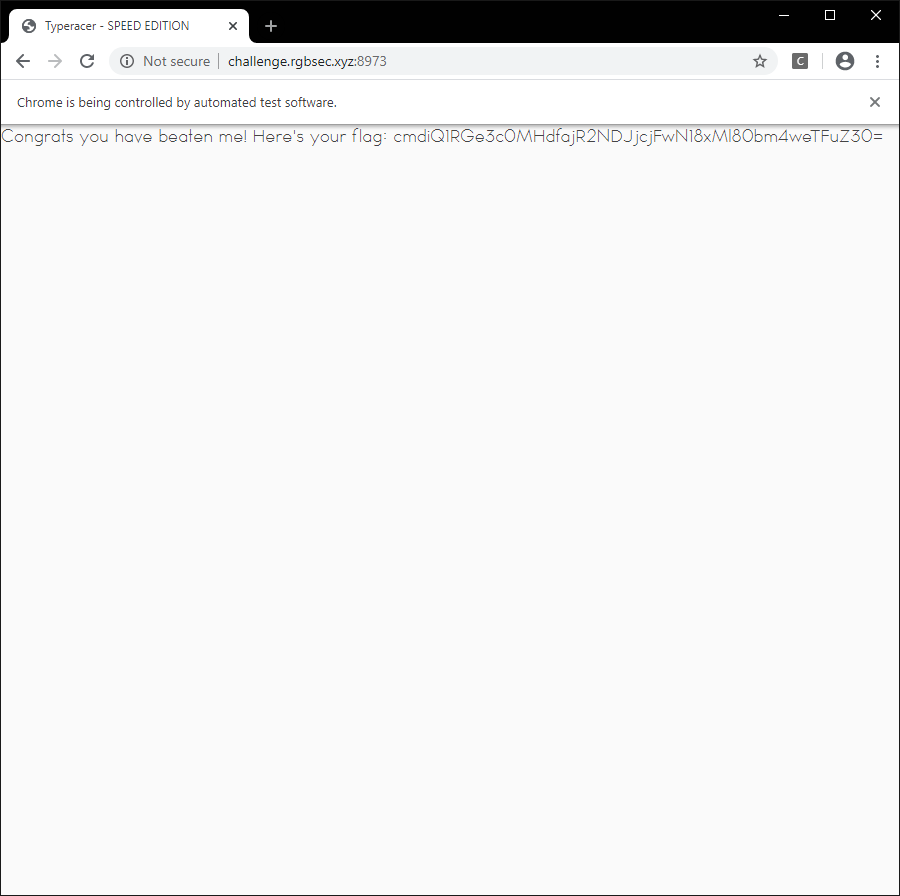

# Typeracer
## Challenge Description
I AM SPEED! Beat me at TypeRacer and the flag is all yours!

[http://challenge.rgbsec.xyz:8973/](http://challenge.rgbsec.xyz:8973/)

## Solution

Visiting the challenge site shows a Typeracer clone:



Just playing through it manually gives the following message:
```
Congrats you have a WPM of [x]! Unfortunately, only keyboarding legends can redeem the flag. Perhaps, try again?
```

suggesting we need to cheat in order to obtain a higher WPM. :') 

Inspecting the site we can see that the text to be typed is in `<span>` tags, with an `order` style attribute that indicates its ordering in the passage. I used BeautifulSoup to parse the text and then Selenium/webdiver in order to automate the inputs (see [typeracer.py](typeracer.py) for the code).



Base64 decoding this string gives us the flag:

## Flag
```rgbCTF{w40w_j4v42cr1p7_12_4nn0y1ng}```

### Author
[onionymous](https://github.com/onionymous)