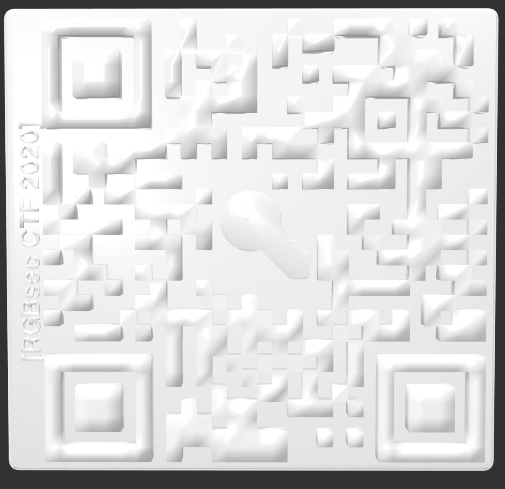

# Peepdis
## Challenge Description
Do you peep what I peep?

File: peepdis.dae

## Solution
You are given a COLLADA 3D asset file, which can be looked at with a variety of programs including Apple Preview. It's a QR code which gives the flag when scanned. 

Since the default material is shiny, I had to play around with brightness and angle to make it work.

### Author
jellybeans